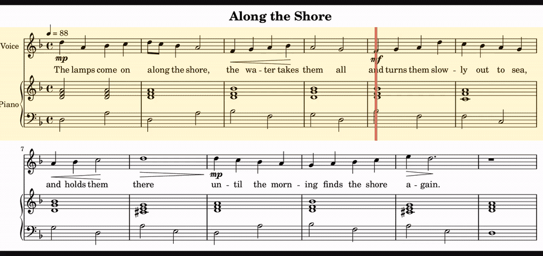
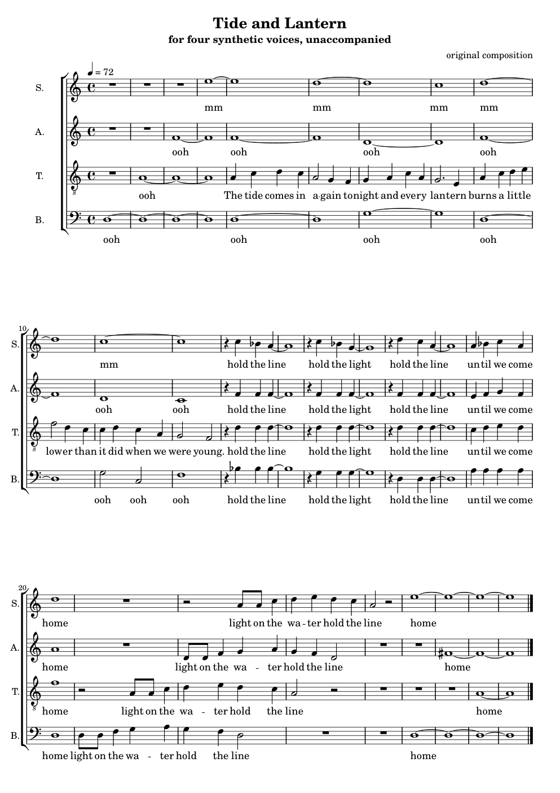

# lilypond-music

**A [Claude Code](https://claude.com/claude-code) skill for writing music.**
Plain text in; engraved notation, a performance, and — if the score has lyrics —
the words actually sung, out.

[](https://github.com/SteliosRapt/Lilypond-music-agents-skill/actions/workflows/checks.yml)
[](LICENSE)



That is not a video edited against an audio track. LilyPond is a *compiler*, so
the same source file produces the picture and the sound — which means the
playhead's position can be **derived** from the score rather than lined up by
hand, and every run prints a verification table proving it landed where it
should.

```bash
bash lilypond-music/scripts/setup.sh                       # once (~1 min)
python3 lilypond-music/scripts/render.py score.ly -o out/  # everything, verified
```

## What comes out of one file

| | |
|---|---|
| `score.pdf` | engraved notation — [the twelve bars above](docs/media/demo-score.png) |
| `score.midi` | performance data, with hairpins as real velocity ramps |
| `score.mp3` | synthesised audio — [these twelve bars, played](docs/media/demo.mp3) |
| `score.mp4` | the pages, playhead on each note as it sounds — the clip above |
| `score-vocal.wav` | the words, sung, by a neural singing model — [four of them at once](songs/tide-and-lantern.mp3) |

The source for all of that is [`docs/media/demo.ly`](docs/media/demo.ly): under
a hundred lines of plain text, one variable per part, which
[`tools/make_media.py`](tools/make_media.py) re-runs to rebuild every image on
this page.

## A finished piece

[](songs/tide-and-lantern.pdf)

**"Tide and Lantern"** — 28 bars of unaccompanied SATB, a different neural
voicebank singing each part. No instruments, no samples, no click: four
synthetic voices and a synthetic room.

🎧 **[mp3](songs/tide-and-lantern.mp3)** · 🎬 **[score video](songs/tide-and-lantern.mp4)** ·
📄 **[pdf](songs/tide-and-lantern.pdf)** · 🎚 **[stems](songs/stems/)** ·
📝 **[how it was made](songs/notes.md)**

[`songs/notes.md`](songs/notes.md) is the interesting half: which bank sings
what and why, the range probe those choices came from, the harmony bar by bar,
and the exact commands — including what was measured and what was not.

## Install it as a skill

Copy or symlink `lilypond-music/` into your skills directory —
`~/.claude/skills/` for personal use, or `.claude/skills/` in a project — and
Claude picks it up from the front matter in its `SKILL.md`. Reading the skill
needs nothing installed; the tools it drives need their own dependencies.

[`lilypond-music/SKILL.md`](lilypond-music/SKILL.md) is the full guide, written
to be read by a person as well as by an agent.

## Singing the words

```bash
bash lilypond-music/scripts/setup-singing.sh                        # onnxruntime, pyyaml
python3 lilypond-music/scripts/sing.py score.ly --preview -o out/   # no voicebank needed
```

**Start with `--preview`.** It sings the line through a built-in formant
synthesiser: robotic, instant, no download. The timing, the syllable placement
and the pitch curve are the real ones — computed by the same code that feeds a
voicebank — so anything wrong there is wrong in the real render too, and
audible in seconds rather than minutes.

For an a cappella arrangement, one bank per part in one command:

```bash
python3 lilypond-music/scripts/sing_ensemble.py score.ly -o out/ \
    --voice soprano=~/voices/liee --voice alto=~/voices/canary \
    --voice tenor=~/voices/tiger  --voice bass=~/voices/triton
```

### Voicebanks are not in this repository

Deliberately. English DiffSinger banks are almost all non-commercial, several
forbid redistribution, and the community vocoders are CC BY-NC-SA 4.0. Nothing
here bundles or downloads one.

[`references/singing-synthesis.md`](lilypond-music/references/singing-synthesis.md)
section 2 lists the four banks that have actually been run through this
pipeline — TIGER, CANARY, TRITON and LIEE — with their release URLs and their
terms. Read the terms; they differ, and all four are non-commercial.
`scripts/dev/bank_check.py` will qualify a bank nobody here has tried, in about
two minutes.

## Layout

```
lilypond-music/        the skill itself; this is what you install
  SKILL.md             what Claude reads first
  references/          the detail: notation, audio, video, singing
  assets/              templates, and the LilyPond instrumentation the tools need
  scripts/             the pipeline
songs/                 a finished piece, its score, and how it was made
docs/                  notes for working on the skill rather than with it
tools/                 repository maintenance; not part of the skill
```

## Working on it

```bash
python3 lilypond-music/scripts/dev/test_units.py    # under a second, numpy + pillow
python3 lilypond-music/scripts/dev/selftest.py      # the whole pipeline, ~2 min
```

Green before you start and green after every commit; both run in CI on every
pull request. [`CONTRIBUTING.md`](CONTRIBUTING.md) is the short version and
[`docs/development.md`](docs/development.md) is the map — what each module is
for, the measured numbers a change must not move, and what is still open.
[`docs/pipeline-notes.md`](docs/pipeline-notes.md) records what was established
about the DiffSinger models by probing them, which is the expensive knowledge
here and mostly is not written down anywhere else.

## Licence

[MIT](LICENSE), for this repository's own contents: the scripts, the skill, the
documentation, and the music in `songs/`.

That covers the code and nothing else. The things this skill *drives* are not
MIT and are not redistributed here: the DiffSinger voicebanks are all
non-commercial and several forbid redistribution, and the community vocoders
are CC BY-NC-SA 4.0.
[`references/singing-synthesis.md`](lilypond-music/references/singing-synthesis.md)
section 2 names each one with its terms. Using this repository's code is one
permission; using a bank with it is a separate one you take up with that bank.
